# GraphRAG MCP Toolkit

> **🚀 Turn your research papers into an intelligent AI assistant that can both chat about your research AND write literature reviews with perfect citations**
> 
> **✨ Features accuracy-first sequential processing architecture with persistent citations, knowledge graph integration, and production-ready deployment**

[](https://www.python.org/downloads/)
[](LICENSE)
[](CONTRIBUTING.md)
[](docs/QUICKSTART.md)
[](FINAL_IMPLEMENTATION_STATUS.md)

## Table of Contents

- [What is this?](#what-is-this)
- [Background: GraphRAG & Knowledge Graphs](#background-graphrag--knowledge-graphs)
- [What is MCP?](#what-is-mcp)
- [How it Works: Technical Overview](#how-it-works-technical-overview)
- [Available MCP Tools](#available-mcp-tools)
- [System Requirements](#system-requirements)
- [Quick Start](#quick-start)
- [Real Example](#real-example)
- [Core Features](#core-features)
- [Documentation](#documentation)
- [Development](#development)
- [Contributing](#contributing)
- [License](#license)

## What is this?

**GraphRAG MCP Toolkit** is an open-source system that transforms your collection of research papers (PDFs) into an intelligent AI assistant. Unlike generic AI that doesn't understand your specific field, this creates a personalized research assistant that:

- **Understands your domain**: Learns the terminology, concepts, and relationships from your papers
- **Chats naturally**: Ask questions like "What are the main themes in transformer research?"
- **Writes literature reviews**: Generate formal academic text with proper citations
- **Tracks citations**: Automatically manages references in APA, IEEE, Nature, and MLA formats
- **Runs locally**: Your data never leaves your computer - complete privacy
- **Integrates with Claude**: Uses Model Context Protocol (MCP) to extend Claude Desktop with your research
- **Enhanced Architecture**: Accuracy-first sequential processing with persistent citations and knowledge graph integration

### How the System Works (Enhanced Sequential Processing)

```mermaid
flowchart TB
    subgraph PREWORK["📊 ENHANCED SEQUENTIAL PROCESSING (Pre-work)"]
        direction TB
        A[📄 PDF Papers] --> B[🔗 LangChain<br/>PDF Loader]
        B --> C[📝 Text Chunks<br/>1000 chars]
        
        C --> E[🦙 llama3.1:8b<br/>LLM Analysis Engine<br/>Sequential Processing]
        
        E --> ANALYSIS[📊 Analysis Result<br/>Entities + Citations + Enhanced Chunks]
        
        ANALYSIS --> STORE1[💾 Store Citations & Entities<br/>with Provenance Links]
        
        STORE1 --> F[📊 ChromaDB<br/>Citation Manager<br/>Persistent Citations]
        STORE1 --> J[🗄️ Neo4j<br/>Entity Manager<br/>Entities + Citation Links]
        
        ANALYSIS --> L[📝 Enhanced Chunks<br/>Entity-Enriched Text]
        
        L --> D[🔢 nomic-embed-text<br/>Direct Embedding Service<br/>Context-Aware Embeddings]
        
        D --> STORE2[💾 Store Embeddings<br/>in ChromaDB]
        
        STORE2 --> F
        
        F --> INT[🔗 Knowledge Graph<br/>Integrator<br/>Bidirectional Links]
        J --> INT
        
        I[🐳 Docker<br/>Neo4j Container] --> J
    end
    
    subgraph MCP["🔌 UNIVERSAL MCP SERVER"]
        direction TB
        UMCP[⚡ Universal MCP Server<br/>Enhanced Architecture]
        
        UMCP --> M[🤖 Claude Desktop<br/>MCP Protocol]
        M --> N[💬 Chat Tools<br/>ask_knowledge_graph<br/>explore_topic<br/>find_connections<br/>what_do_we_know_about]
        M --> O[📝 Literature Tools<br/>gather_sources_for_topic<br/>get_facts_with_citations<br/>verify_claim_with_sources<br/>generate_bibliography<br/>track_citations_used]
        M --> P[🔧 Core Tools<br/>load_document_collection<br/>search_documents<br/>switch_template<br/>server_status]
    end
    
    %% Connections between groups
    INT --> UMCP
    
    %% Styling
    classDef ollama fill:#f3e5f5,stroke:#7b1fa2,stroke-width:2px
    classDef storage fill:#e8f5e8,stroke:#2e7d32,stroke-width:2px
    classDef claude fill:#e3f2fd,stroke:#1565c0,stroke-width:2px
    classDef docker fill:#fff3e0,stroke:#ef6c00,stroke-width:2px
    classDef prework fill:#f8f9fa,stroke:#495057,stroke-width:3px
    classDef mcpgroup fill:#e8f4f8,stroke:#0056b3,stroke-width:3px
    classDef enhanced fill:#e8f5e8,stroke:#2e7d32,stroke-width:3px
    
    class E,D ollama
    class F,J,K,INT storage
    class G,L prework
    class M,N,O,P claude
    class I docker
    class PREWORK prework
    class MCP mcpgroup
    class UMCP enhanced
```



## 🚀 Sequential Processing Architecture

This toolkit uses a **production-ready sequential processing architecture** that provides:

### **Sequential Processing Flow**
1. **📄 PDF Loading**: Extract text and create initial chunks
2. **🧠 LLM Analysis**: Comprehensive entity and citation extraction
3. **📝 Enhanced Chunks**: Text enriched with entity information
4. **🔢 Context-Aware Embeddings**: Generated from enhanced chunks
5. **💾 Persistent Storage**: Citations in ChromaDB, entities in Neo4j
6. **🔗 Provenance Linking**: Bidirectional entity-citation relationships

### **Key Features**
- **Sequential Processing**: Each step builds on the previous for maximum accuracy
- **Persistent Citations**: ChromaDB storage survives system restarts
- **Knowledge Graph Integration**: Bidirectional entity-citation links in Neo4j
- **Context-Aware Embeddings**: Generated from entity-enriched text for better search
- **Citation Provenance**: Full tracking from source to usage

### **Architecture Benefits**
- **High Accuracy**: Sequential processing ensures context flows through each step
- **Reliable Citations**: Persistent storage with 4 academic styles (APA, IEEE, Nature, MLA)
- **Superior Search**: Embeddings include entity context for semantic search
- **Production Ready**: Comprehensive error handling and configuration management

For detailed technical information, see [FINAL_IMPLEMENTATION_STATUS.md](FINAL_IMPLEMENTATION_STATUS.md).

## Background: GraphRAG & Knowledge Graphs

### What is GraphRAG?

**GraphRAG** (Graph Retrieval-Augmented Generation) is an advanced AI technique that combines:

- **Traditional RAG**: Retrieves relevant text chunks from documents to answer questions
- **Knowledge Graphs**: Creates a web of interconnected concepts, entities, and relationships
- **Graph-based reasoning**: Understands how concepts relate across your entire document collection

**Why is this better than regular RAG?**
- **Context limits**: LLMs can only process ~100k tokens at once, but you might have millions of tokens across papers
- **Relationship understanding**: Finds connections between papers that mention related concepts
- **Semantic search**: Goes beyond keyword matching to understand meaning and context

### What are Knowledge Graphs?

A **knowledge graph** is a network of interconnected facts. For research papers, it captures:

- **Entities**: Authors, methods, datasets, concepts, results
- **Relationships**: "Author X collaborated with Author Y", "Method A improves on Method B"
- **Attributes**: Publication years, accuracy scores, experimental conditions

**Example from ML papers:**
```
[Transformer] --improves--> [RNN]
[Transformer] --uses--> [Attention Mechanism]
[BERT] --implements--> [Transformer]
[GPT] --implements--> [Transformer]
[Vaswani et al.] --authored--> [Transformer]
```

## What is MCP?

**Model Context Protocol (MCP)** is Anthropic's standard for connecting AI assistants to external tools and data sources. Think of it as a way to give Claude "superpowers" - access to your specific data and custom functions.

### How MCP Works:
1. **Your system** runs an MCP server with custom tools
2. **Claude Desktop** connects to your MCP server
3. **Claude can now use your tools** to access your research data
4. **You get responses** that combine Claude's reasoning with your specific documents

### Why MCP for Research?
- **No context limits**: Claude can access your entire paper collection through tools
- **Always up-to-date**: Add new papers and Claude immediately has access
- **Specialized tools**: Custom functions for literature review, citation management, etc.
- **Privacy**: Your data stays on your computer, only tool results go to Claude

## How it Works: Technical Overview

### The Complete Processing Pipeline:

1. **PDF Ingestion**
   - Uses **LangChain** to extract text from PDFs
   - Handles various PDF formats and structures
   - Preserves document metadata (authors, titles, dates)

2. **Text Processing & Chunking**
   - Splits documents into manageable chunks (~1000 chars)
   - Maintains context and paragraph boundaries
   - Creates overlapping chunks for continuity

3. **Entity & Citation Analysis (First Pass)**
   - **Ollama** (`llama3.1:8b`) performs comprehensive content analysis
   - Extracts 20+ entity categories: authors, methods, datasets, concepts, results
   - Identifies relationships between entities across papers
   - Extracts citations with precise context and location mapping

4. **Content Enhancement**
   - Text chunks enriched with extracted entity and citation metadata
   - Creates context-aware content for more accurate embeddings
   - Preserves semantic importance of discovered entities

5. **Context-Aware Embedding Generation**
   - **nomic-embed-text** processes entity-enriched chunks
   - Creates 768-dimensional vectors that understand entity importance
   - Enables semantic similarity search with entity context

6. **Knowledge Graph Construction with Citation Links**
   - **Graphiti** builds real-time knowledge graphs from extracted entities
   - Links entities to their source citations for provenance tracking
   - Stores entities and relationships in **Neo4j** database with citation metadata
   - Creates persistent, queryable graph structure with source attribution

7. **Citation Storage & Knowledge Graph Integration**
   - Citations stored in **ChromaDB** alongside context-aware embeddings
   - Entity-citation links stored in **Neo4j** for provenance tracking
   - Bidirectional linking between knowledge graph and citation sources
   - Maps citations to exact locations in papers
   - Supports 4 academic formats (APA, IEEE, Nature, MLA)
   - Cross-session citation continuity

8. **MCP Server Generation**
   - Creates **FastMCP** server with custom tools
   - Provides dual-mode interface (chat + literature review)
   - Enables **Claude Desktop** integration

9. **LLM Integration**
   - **Claude** uses MCP tools to query your research
   - Combines graph traversal with semantic search
   - Generates responses with proper citations

## Available MCP Tools

When you connect this system to Claude Desktop, Claude gains access to these specialized research tools:

### 🗣️ Chat Tools (Conversational Mode)
- `ask_knowledge_graph` - Natural Q&A with your research content
- `explore_topic` - Deep dive into specific topics with different detail levels
- `find_connections` - Discover relationships between concepts across papers
- `what_do_we_know_about` - Comprehensive knowledge summaries with gaps analysis

### 📝 Literature Review Tools (Formal Writing Mode)
- `gather_sources_for_topic` - Organize relevant papers for specific topics
- `get_facts_with_citations` - Get citation-ready statements in academic format
- `verify_claim_with_sources` - Evidence-based verification of research claims
- `get_topic_outline` - Generate structured literature review outlines
- `track_citations_used` - Monitor citation usage and avoid over-citing
- `generate_bibliography` - Create formatted bibliographies in any style

### 🔍 Analysis Tools
- `search_documents` - Semantic search across your entire corpus
- `query_papers` - Find specific papers matching criteria
- `research_gaps` - Identify unexplored areas in your field
- `methodology_overview` - Compare research approaches across papers
- `author_analysis` - Analyze collaboration networks and author influence
- `concept_evolution` - Track how ideas develop over time

## System Requirements

### Hardware Requirements
- **CPU**: Modern multi-core processor (Intel i5/AMD Ryzen 5 or better)
- **RAM**: 
  - **16GB minimum** for small collections (10-20 papers)
  - **32GB recommended** for large collections (50+ papers)
- **Storage**: 
  - **10GB free space** for models and dependencies
  - **Additional space** for your document collection and databases
- **GPU**: Optional but recommended for faster processing
  - **NVIDIA GPU** with 8GB+ VRAM for optimal performance
  - **Apple Silicon** (M1/M2/M3) works excellently

### Software Requirements
- **Operating System**: macOS 10.15+, Ubuntu 18.04+, Windows 10+
- **Python**: 3.9 or higher
- **Docker**: For Neo4j database (optional but recommended)
- **Ollama**: For local AI models
- **Claude Desktop**: For MCP integration

### Network Requirements
- **Internet connection** for initial setup (downloading models)
- **~4GB download** for Ollama models (one-time)
- **Local processing** after setup - no internet required for operation

## Quick Start

### Step 1: Get the Code

```bash
# Clone the repository
git clone https://github.com/your-org/graphrag-mcp-toolkit.git
cd graphrag-mcp-toolkit

# Set up Python environment (one command does everything)
./setup_env.sh
```

### Step 2: Install Dependencies

```bash
# Install Ollama
brew install ollama  # Mac
# or download from https://ollama.com for other platforms

# Install Docker (for Neo4j)
# Download from https://docker.com

# Start services
make setup-ollama    # Downloads AI models (~4GB)
make setup-neo4j     # Starts Neo4j container
```

### Step 3: Test Your Setup

```bash
# Test enhanced architecture components
python3 tests/test_enhanced_architecture.py

# Test MCP integration
python3 tests/test_mcp_simple.py

# If you see green checkmarks, you're ready!
```

### Step 4: Process Your First Papers

```bash
# Start the interactive tutorial (easiest way)
./start_tutorial.sh

# This opens a Jupyter notebook that walks you through:
# 1. Adding your PDF files
# 2. Processing them into a knowledge graph
# 3. Starting the MCP server
# 4. Connecting to Claude Desktop
```

### Step 5: Start MCP Server & Connect to Claude Desktop

```bash
# Start the Universal MCP Server with enhanced architecture
python3 -m graphrag_mcp.cli.main serve-universal --template academic --transport stdio

# The system auto-generates Claude Desktop configuration
cat claude_desktop_config.json

# Copy this to your Claude Desktop settings
# (~/.config/claude-desktop/config.json)
```

**Then restart Claude Desktop** and look for the 🔌 icon to confirm connection.

## Real Example

**Before:** You have 30 papers on "machine learning for drug discovery" scattered across your computer. Writing a literature review means manually reading each paper, taking notes, and trying to remember which paper said what.

**After:** You upload all 30 papers to this system. Now you can:

### Chat with Your Research:
- **You:** "What are the main approaches to using transformers in drug discovery?"
- **Claude:** "Based on your papers, there are three main approaches: 1) Molecular property prediction using ChemFormer (Chen et al. 2023), 2) Drug-target interaction modeling with MolTrans (Kumar et al. 2024), and 3) Virtual screening using attention mechanisms (Torres et al. 2023). Let me explain each approach..."

### Generate Literature Review Text:
- **You:** "Write a paragraph about transformer architectures in drug discovery with citations in APA format"
- **Claude:** "Transformer architectures have emerged as a powerful approach to molecular property prediction. Chen et al. (2023) developed ChemFormer, which combines graph neural networks with transformer attention mechanisms to achieve 94% accuracy on molecular solubility prediction tasks. Building on this work, Kumar et al. (2024) introduced MolTrans, which incorporates positional encoding to improve drug-target interaction predictions by 15% over previous methods..."

### Track Citations:
- **You:** "Have I used the Chen paper too much in my writing?"
- **Claude:** "You've cited Chen et al. (2023) 8 times across your literature review. This is within acceptable limits for a foundational paper, but you might want to balance with other recent work like Torres et al. (2023) which you've only cited twice."

## Core Features

### 🚀 **Sequential Processing Architecture**
- **Step-by-Step Processing**: PDF → Chunks → LLM Analysis → Enhanced Chunks → Embeddings → Storage
- **Accuracy-First Design**: Each step builds on the previous for maximum precision
- **Direct Embedding Model Usage** (nomic-embed-text) for superior semantic search
- **Persistent Citation Storage** in ChromaDB with cross-session continuity
- **Knowledge Graph Integration** with bidirectional entity-citation links
- **Context-Aware Embeddings** generated from entity-enriched text

### 🔗 **Citation Management**
- **4 Academic Styles** (APA, IEEE, Nature, MLA) with automatic formatting
- **Citation Provenance Tracking** linking every citation to source entities
- **Usage Analytics** preventing over-citation and ensuring balance
- **Semantic Citation Search** finding relevant citations by content
- **Cross-Reference Validation** ensuring citation accuracy

### 🔒 **Privacy-First Architecture**
- **100% local processing** with Ollama (llama3.1:8b + nomic-embed-text)
- **No external API calls** for document analysis
- **Your data stays on your machine**
- **Secure Neo4j storage** with Docker isolation

### 📊 **Production-Ready Features**
- **Architecture Testing**: `tests/test_enhanced_architecture.py`
- **MCP Integration Testing**: `tests/test_mcp_simple.py`
- **End-to-end Validation**: `tests/test_mcp_integration.py`
- **Health Monitoring**: Automated system diagnostics
- **Configuration Management**: Environment-based settings with validation
- **Error Recovery**: Comprehensive error handling and graceful degradation

### 🛠️ **Developer-Friendly**
- **Modern Python 3.9+** with proper type hints
- **Comprehensive error handling** with recovery mechanisms
- **Resource management** with automatic cleanup
- **Performance monitoring** with detailed metrics

## Documentation

### Essential Guides
- **[Quick Start Guide](docs/QUICKSTART.md)** - Get up and running in 5 minutes
- **[API Reference](docs/API_REFERENCE.md)** - Complete API documentation
- **[Usage Guide](docs/USAGE_GUIDE.md)** - Comprehensive dual-mode workflows

### Architecture & Development
- **[Architecture Flow](docs/ARCHITECTURE_FLOW.md)** - System design and data flow
- **[Component Interactions](docs/COMPONENT_INTERACTIONS.md)** - How components work together
- **[Data Flow Visualization](docs/DATA_FLOW_VISUALIZATION.md)** - Visual system overview

## Development

### Environment Setup
```bash
# Complete development environment
make dev

# Individual components
make install-dev      # Development dependencies
make setup-ollama     # Install AI models
make setup-neo4j      # Start Neo4j container
```

### Code Quality
```bash
make lint            # Run ruff, black, mypy
make format          # Format code
make type-check      # Type checking
make quality         # All quality checks
```

### Testing
```bash
make test            # Run all tests with coverage
python3 tests/test_enhanced_architecture.py  # Enhanced architecture validation
python3 tests/test_mcp_simple.py          # MCP integration
python3 tests/test_mcp_integration.py     # End-to-end testing
```

### Services Management
```bash
make setup-ollama    # Install Ollama models
make setup-neo4j     # Start Neo4j container
make clear-db        # Clear all databases
```

## Contributing

We welcome contributions! See [CONTRIBUTING.md](CONTRIBUTING.md) for guidelines.

### Development Setup
```bash
git clone https://github.com/your-org/graphrag-mcp-toolkit.git
cd graphrag-mcp-toolkit
make dev
make test
```

## License

This project is licensed under the MIT License - see the [LICENSE](LICENSE) file for details.

## Acknowledgments

- **Microsoft GraphRAG**: Inspiration for graph-based RAG
- **Anthropic MCP**: Model Context Protocol specification
- **Ollama**: Local LLM inference platform
- **Graphiti**: Real-time knowledge graph platform
- **Neo4j**: Graph database technology
- **LangChain**: Document processing framework

---

**Transform your documents into intelligent research assistants with GraphRAG MCP Toolkit!** 🚀

For support, questions, or contributions, please see our [documentation](docs/) or open an issue on GitHub.