# GraphRAG MCP Toolkit

> **🚀 Turn your research papers into an intelligent AI assistant in under 1 hour**
> 
> Transform your collection of PDFs into a personalized research assistant that understands your specific field and helps you write literature reviews with automatic citations.

[](https://www.python.org/downloads/)
[](LICENSE)
[](CONTRIBUTING.md)

## What is this?

**GraphRAG MCP Toolkit** transforms your collection of research papers (PDFs) into an intelligent AI assistant. Unlike generic AI that doesn't understand your specific field, this creates a personalized research assistant that:

- **Understands your domain**: Learns the terminology, concepts, and relationships from your papers
- **Chats naturally**: Ask questions like "What are the main themes in transformer research?"
- **Writes literature reviews**: Generate formal academic text with proper citations
- **Tracks citations**: Automatically manages references in APA, IEEE, Nature, and MLA formats
- **Runs locally**: Your data never leaves your computer - complete privacy
- **Integrates with Claude**: Uses Model Context Protocol (MCP) to extend Claude Desktop with your research

## Three Ways to Use It

### 1. 🖥️ Command Line Interface (CLI)
**Perfect for**: Most users, automation, scripting

```bash
# One-command setup
graphrag-mcp quick-setup my-research ./papers/ --auto-serve

# Or step-by-step
graphrag-mcp create my-research --template academic
graphrag-mcp add-documents my-research ./papers/ --recursive
graphrag-mcp process my-research
graphrag-mcp serve my-research --transport stdio
```

📖 **[Complete CLI Reference →](docs/CLI_REFERENCE.md)**

### 2. 🐍 Python API
**Perfect for**: Developers, custom integrations, notebooks

```python
from graphrag_mcp.api import quick_setup, quick_process

# One-line setup
processor = quick_setup("my-research", "./papers/", template="academic")

# One-line processing
processor = await quick_process("my-research", "./papers/", template="academic")
```

📖 **[Complete API Reference →](docs/API_REFERENCE.md)**

### 3. 🔧 MCP Tools (for Claude Desktop)
**Perfect for**: Claude Desktop users, AI-assisted research

```python
# Chat tools (conversational)
ask_knowledge_graph("What are the main themes in transformer research?")
explore_topic("attention mechanisms", scope="detailed")

# Literature tools (formal writing)
get_facts_with_citations("transformer architecture", style="APA")
generate_bibliography(style="APA", used_only=True)
```

📖 **[Complete MCP Tools Reference →](docs/MCP_TOOLS.md)**

## Quick Start

### Step 1: Install

```bash
# Clone the repository
git clone https://github.com/your-org/graphrag-mcp-toolkit.git
cd graphrag-mcp-toolkit

# Set up environment (creates Python environment + installs dependencies)
./setup_env.sh
```

### Step 2: Install Dependencies

```bash
# Install Ollama (for local AI)
brew install ollama  # Mac
# or download from https://ollama.com for other platforms

# Install Docker (for Neo4j - optional)
# Download from https://docker.com

# Start services
make setup-ollama    # Downloads AI models (~4GB)
make setup-neo4j     # Starts Neo4j container (optional)
```

### Step 3: Process Your Papers

```bash
# Quick setup (easiest way)
graphrag-mcp quick-setup my-research ./papers/ --auto-serve

# This will:
# 1. Create a new project
# 2. Add your PDF files
# 3. Process them into a knowledge graph
# 4. Start the MCP server
```

### Step 4: Connect to Claude Desktop

```bash
# The system auto-generates Claude Desktop configuration
cat claude_desktop_config.json

# Copy this to your Claude Desktop settings
# (~/.config/claude-desktop/config.json)
```

**Then restart Claude Desktop** and look for the 🔌 icon to confirm connection.

## Real Example

**Before:** You have 30 papers on "machine learning for drug discovery" scattered across your computer. Writing a literature review means manually reading each paper, taking notes, and trying to remember which paper said what.

**After:** You upload all 30 papers to this system. Now you can:

### Chat with Your Research:
- **You:** "What are the main approaches to using transformers in drug discovery?"
- **Claude:** "Based on your papers, there are three main approaches: 1) Molecular property prediction using ChemFormer (Chen et al. 2023), 2) Drug-target interaction modeling with MolTrans (Kumar et al. 2024), and 3) Virtual screening using attention mechanisms (Torres et al. 2023)..."

### Generate Literature Review Text:
- **You:** "Write a paragraph about transformer architectures in drug discovery with citations in APA format"
- **Claude:** "Transformer architectures have emerged as a powerful approach to molecular property prediction. Chen et al. (2023) developed ChemFormer, which combines graph neural networks with transformer attention mechanisms to achieve 94% accuracy on molecular solubility prediction tasks..."

### Track Citations:
- **You:** "Have I used the Chen paper too much in my writing?"
- **Claude:** "You've cited Chen et al. (2023) 8 times across your literature review. This is within acceptable limits for a foundational paper, but you might want to balance with other recent work..."

## How it Works

### Enhanced Sequential Processing Architecture

```mermaid
flowchart TB
    subgraph PREWORK["📊 ENHANCED SEQUENTIAL PROCESSING (Pre-work)"]
        direction TB
        A[📄 PDF Papers] --> B[🔗 LangChain<br/>PDF Loader]
        B --> C[📝 Text Chunks<br/>1000 chars]
        
        C --> E[🦙 llama3.1:8b<br/>LLM Analysis Engine<br/>Sequential Processing]
        
        E --> ANALYSIS[📊 Analysis Result<br/>Entities + Citations + Enhanced Chunks]
        
        ANALYSIS --> STORE1[💾 Store Citations & Entities<br/>with Provenance Links]
        
        STORE1 --> F[📊 ChromaDB<br/>Citation Manager<br/>Persistent Citations]
        STORE1 --> J[🗄️ Neo4j<br/>Entity Manager<br/>Entities + Citation Links]
        
        ANALYSIS --> L[📝 Enhanced Chunks<br/>Entity-Enriched Text]
        
        L --> D[🔢 nomic-embed-text<br/>Direct Embedding Service<br/>Context-Aware Embeddings]
        
        D --> STORE2[💾 Store Embeddings<br/>in ChromaDB]
        
        STORE2 --> F
        
        F --> INT[🔗 Knowledge Graph<br/>Integrator<br/>Bidirectional Links]
        J --> INT
        
        I[🐳 Docker<br/>Neo4j Container] --> J
    end
    
    subgraph MCP["🔌 UNIVERSAL MCP SERVER"]
        direction TB
        UMCP[⚡ Universal MCP Server<br/>Enhanced Architecture]
        
        UMCP --> M[🤖 Claude Desktop<br/>MCP Protocol]
        M --> N[💬 Chat Tools<br/>ask_knowledge_graph<br/>explore_topic<br/>find_connections<br/>what_do_we_know_about]
        M --> O[📝 Literature Tools<br/>gather_sources_for_topic<br/>get_facts_with_citations<br/>verify_claim_with_sources<br/>generate_bibliography<br/>track_citations_used]
        M --> P[🔧 Core Tools<br/>load_document_collection<br/>search_documents<br/>switch_template<br/>server_status]
    end
    
    %% Connections between groups
    INT --> UMCP
    
    %% Styling
    classDef ollama fill:#f3e5f5,stroke:#7b1fa2,stroke-width:2px
    classDef storage fill:#e8f5e8,stroke:#2e7d32,stroke-width:2px
    classDef claude fill:#e3f2fd,stroke:#1565c0,stroke-width:2px
    classDef docker fill:#fff3e0,stroke:#ef6c00,stroke-width:2px
    classDef prework fill:#f8f9fa,stroke:#495057,stroke-width:3px
    classDef mcpgroup fill:#e8f4f8,stroke:#0056b3,stroke-width:3px
    classDef enhanced fill:#e8f5e8,stroke:#2e7d32,stroke-width:3px
    
    class E,D ollama
    class F,J,K,INT storage
    class G,L prework
    class M,N,O,P claude
    class I docker
    class PREWORK prework
    class MCP mcpgroup
    class UMCP enhanced
```



### The Complete Processing Pipeline:

1. **PDF Ingestion** - Extract text from PDFs using LangChain
2. **Text Processing** - Split into manageable chunks with context preservation
3. **LLM Analysis** - Ollama (llama3.1:8b) extracts entities, relationships, and citations
4. **Content Enhancement** - Text chunks enriched with entity metadata
5. **Context-Aware Embeddings** - nomic-embed-text generates vectors from enhanced chunks
6. **Knowledge Graph Construction** - Graphiti builds real-time knowledge graphs in Neo4j
7. **Citation Storage** - Citations stored in ChromaDB with full context tracking
8. **MCP Server Generation** - FastMCP server provides tools for Claude Desktop

## System Requirements

### Hardware Requirements
- **CPU**: Modern multi-core processor (Intel i5/AMD Ryzen 5 or better)
- **RAM**: 16GB minimum, 32GB recommended for large collections
- **Storage**: 10GB free space for models and dependencies
- **GPU**: Optional but recommended (NVIDIA GPU with 8GB+ VRAM or Apple Silicon)

### Software Requirements
- **Operating System**: macOS 10.15+, Ubuntu 18.04+, Windows 10+
- **Python**: 3.11 or higher
- **Docker**: For Neo4j database (optional but recommended)
- **Ollama**: For local AI models
- **Claude Desktop**: For MCP integration

## Core Features

### 🚀 **Sequential Processing Architecture**
- **Step-by-Step Processing**: PDF → Analysis → Enhanced Chunks → Embeddings → Storage
- **Accuracy-First Design**: Each step builds on the previous for maximum precision
- **Persistent Citation Storage** in ChromaDB with cross-session continuity
- **Knowledge Graph Integration** with bidirectional entity-citation links

### 🔗 **Citation Management**
- **4 Academic Styles** (APA, IEEE, Nature, MLA) with automatic formatting
- **Citation Provenance Tracking** linking every citation to source entities
- **Usage Analytics** preventing over-citation and ensuring balance
- **Semantic Citation Search** finding relevant citations by content

### 🔒 **Privacy-First Architecture**
- **100% local processing** with Ollama (no external API calls)
- **Your data stays on your machine**
- **Secure storage** with Docker isolation

### 🛠️ **Three User Interfaces**
- **CLI**: 11 commands for complete project management
- **Python API**: Developer-friendly integration
- **MCP Tools**: 10+ tools for Claude Desktop integration

## Available MCP Tools

When you connect this system to Claude Desktop, Claude gains access to specialized research tools:

### 🗣️ Chat Tools (Conversational Mode)
- `ask_knowledge_graph` - Natural Q&A with your research content
- `explore_topic` - Deep dive into specific topics
- `find_connections` - Discover relationships between concepts
- `what_do_we_know_about` - Comprehensive knowledge summaries

### 📝 Literature Review Tools (Formal Writing Mode)
- `gather_sources_for_topic` - Organize relevant papers for topics
- `get_facts_with_citations` - Get citation-ready statements
- `verify_claim_with_sources` - Evidence-based verification
- `generate_bibliography` - Create formatted bibliographies

### 🔍 Analysis Tools
- `search_documents` - Semantic search across your corpus
- `research_gaps` - Identify unexplored areas
- `methodology_overview` - Compare research approaches
- `concept_evolution` - Track how ideas develop over time

## Documentation

### 📖 Essential Documentation
- **[CLI Reference](docs/CLI_REFERENCE.md)** - Complete command-line interface documentation
- **[API Reference](docs/API_REFERENCE.md)** - Python API documentation for developers
- **[MCP Tools Reference](docs/MCP_TOOLS.md)** - All MCP tools for Claude Desktop integration

### 🚀 System Architecture
The toolkit uses a **sequential processing architecture** with three main components:
1. **Enhanced Document Processor** - Sequential processing with LLM analysis
2. **ChromaDB Citation Manager** - Persistent citation tracking with 4 academic styles
3. **Neo4j Entity Manager** - Knowledge graph storage with entity relationships

## Development

### Environment Setup
```bash
# Complete development environment
make dev

# Individual components
make install-dev      # Development dependencies
make setup-ollama     # Install AI models
make setup-neo4j      # Start Neo4j container
```

### Code Quality
```bash
make lint            # Run ruff, black, mypy
make format          # Format code
make type-check      # Type checking
make quality         # All quality checks
```

### Testing
```bash
make test            # Run all tests with coverage
```

## Troubleshooting

### Common Issues
1. **"Command not found"**: `pip install --upgrade graphrag-mcp-toolkit`
2. **"Ollama not accessible"**: `ollama serve` in separate terminal
3. **"Processing failed"**: `graphrag-mcp validate --verbose --fix`
4. **"Neo4j connection failed"**: Optional - system works without Neo4j

### Getting Help
```bash
# System validation
graphrag-mcp validate --verbose

# Check system status
graphrag-mcp status

# Get command help
graphrag-mcp --help
```

### Documentation Links
- **[CLI Troubleshooting](docs/CLI_REFERENCE.md#troubleshooting)** - Complete CLI troubleshooting guide
- **[API Troubleshooting](docs/API_REFERENCE.md#troubleshooting)** - Python API debugging
- **[MCP Tools Issues](docs/MCP_TOOLS.md#troubleshooting)** - Claude Desktop integration help

## Contributing

We welcome contributions! See [CONTRIBUTING.md](CONTRIBUTING.md) for guidelines.

### Development Setup
```bash
git clone https://github.com/your-org/graphrag-mcp-toolkit.git
cd graphrag-mcp-toolkit
make dev
make test
```

## License

This project is licensed under the MIT License - see the [LICENSE](LICENSE) file for details.

## What's Next?

1. **Load your documents** with `graphrag-mcp quick-setup my-research ./papers/`
2. **Connect to Claude Desktop** using the MCP server
3. **Explore your research** with conversational tools
4. **Write literature reviews** with automatic citations

Ready to transform your documents into an intelligent research assistant? Start with the **[Quick Start](#quick-start)** guide above!

---

**Transform your documents into intelligent research assistants with GraphRAG MCP Toolkit!** 🚀

For support, questions, or contributions, please see our [complete documentation](docs/) or open an issue on GitHub.