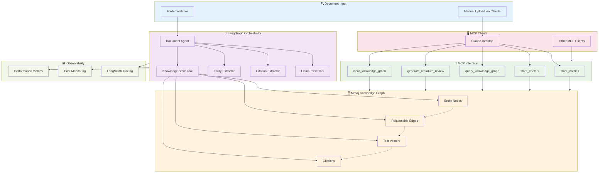

# Document Processing Orchestrator Architecture

## System Overview

A production-ready document processing system that combines intelligent orchestration with a knowledge graph storage backend. The system watches folders for new PDFs, processes them through AI-driven workflows, and stores structured knowledge in Neo4j for querying via MCP tools.

## Architecture Diagram



## Core Components

### 1. LangGraph Document Orchestrator
**Purpose**: Intelligent AI-driven document processing workflow
**Technology**: LangGraph + Groq LLM (Llama 3.1 70B)

**Key Features**:
- **Stateful processing**: Maintains context across document steps
- **Streaming responses**: Real-time processing feedback
- **Tool orchestration**: Coordinates LlamaParse, extraction, and storage
- **Error handling**: Robust retry and fallback mechanisms
- **Dynamic decisions**: LLM decides processing strategy per document

**Architecture Pattern**:
```python
# Modern LangGraph Agent Pattern
agent = create_react_agent(
    model=ChatGroq(model="llama-3.1-70b-versatile"),
    tools=[llamaparse_pdf, extract_citations, store_in_neo4j],
    checkpointer=MemorySaver()
)
```

### 2. Neo4j Unified Storage
**Purpose**: Single database for both graph and vector storage
**Technology**: Neo4j 5.x with native vector capabilities

**Storage Types**:
- **Entity Nodes**: People, concepts, technologies, organizations
- **Relationship Edges**: Semantic connections between entities
- **Text Vectors**: Document chunks with embeddings for semantic search
- **Citation Metadata**: Full provenance and bibliographic data

**Vector Integration**:
```cypher
// Native Neo4j vector storage
CREATE (tv:TextVector {
  id: $vector_id,
  content: $content,
  embedding: $embedding,
  document_id: $document_id
})
```

### 3. MCP Knowledge Graph Interface
**Purpose**: Expose knowledge graph capabilities to any MCP client
**Technology**: FastMCP server with 5 specialized tools

**Tool Architecture**:
```
src/tools/
├── storage/
│   ├── entity_storage.py     # store_entities
│   ├── text_storage.py       # store_vectors  
│   └── database_management.py # clear_knowledge_graph
└── query/
    ├── knowledge_search.py    # query_knowledge_graph
    └── literature_generation.py # generate_literature_review
```

### 4. Folder Watching System
**Purpose**: Automated document discovery and processing
**Technology**: Watchdog + LangGraph integration

**Workflow**:
1. Monitor designated folders for new PDFs
2. Trigger LangGraph orchestrator for each new document
3. Stream processing status to logs/monitoring
4. Optionally notify MCP clients of new knowledge

## Tech Stack Details

### Core Framework
```toml
# Modern LangChain Ecosystem
"langchain>=0.3.0"        # Core framework
"langgraph>=0.2.0"        # Stateful orchestration  
"langchain-groq>=0.2.0"   # Groq LLM integration
"langsmith>=0.1.0"        # Production monitoring
```

### Document Processing
```toml
# Premium PDF Processing
"llamaparse>=0.5.0"       # High-quality PDF extraction
"watchdog>=3.0.0"         # Folder monitoring
```

### Knowledge Storage
```toml
# Unified Neo4j Storage
"neo4j>=5.0.0"            # Graph + vector database
"sentence-transformers>=2.0.0"  # Local embeddings
```

### MCP Interface
```toml
# MCP Server Framework
"fastmcp>=0.2.0"          # Modern MCP server
"pydantic>=2.0.0"         # Data validation
```

### Monitoring Stack
- **LangSmith**: Tracing, debugging, cost monitoring
- **Neo4j Browser**: Graph visualization and debugging
- **Python Logging**: Structured application logs
- **Environment Variables**: Configuration management

## Data Flow Architecture

### 1. Document Ingestion Flow
```
PDF Document → LlamaParse API → Structured Text → LangGraph Agent
```

**Processing Steps**:
1. **Document Detection**: Folder watcher or manual upload
2. **PDF Parsing**: LlamaParse extracts text, tables, figures
3. **Agent Orchestration**: LangGraph agent analyzes content
4. **Dynamic Processing**: LLM decides extraction strategy

### 2. Knowledge Extraction Flow
```
Structured Text → Citation Extractor → Entity Extractor → Neo4j Storage
```

**Extraction Pipeline**:
1. **Citation Analysis**: Extract bibliographic metadata
2. **Entity Recognition**: Identify people, concepts, technologies
3. **Relationship Mapping**: Connect entities with context
4. **Vector Generation**: Create embeddings for semantic search

### 3. Knowledge Query Flow
```
MCP Client → Query Tool → Neo4j Search → Formatted Response
```

**Query Types**:
- **Graph Traversal**: Entity relationships and connections
- **Vector Search**: Semantic similarity matching
- **Hybrid Queries**: Combined graph + vector results
- **Literature Reviews**: Formatted academic output

## Deployment Architecture

### Development Environment
```bash
# Local Development Stack
Docker (Neo4j)           # Graph database
Python 3.11+ (UV)        # Modern Python tooling
LangGraph Agent          # Document orchestrator
FastMCP Server           # MCP interface
Claude Desktop           # Primary MCP client
```

### Production Considerations
1. **Scaling**: Horizontal LangGraph agent scaling
2. **Reliability**: Neo4j clustering for high availability
3. **Monitoring**: LangSmith production observability
4. **Security**: API key management and data privacy
5. **Cost Control**: Groq usage monitoring and limits

## Key Design Decisions

### 1. Neo4j-Only Storage
**Decision**: Use Neo4j for both graph and vector storage
**Rationale**: 
- Simplifies architecture (single database)
- Native vector capabilities in Neo4j 5.x
- Unified querying across graph and vectors
- Reduces operational complexity

### 2. LangGraph Orchestration
**Decision**: Use LangGraph instead of linear workflows
**Rationale**:
- LLM makes intelligent processing decisions
- Stateful workflow management
- Built-in streaming and error handling
- Production-ready agent framework

### 3. Groq for AI Processing
**Decision**: Use Groq API for LLM inference
**Rationale**:
- Fast inference speeds (important for orchestration)
- Cost-effective for high-volume processing
- Llama 3.1 70B provides excellent reasoning
- Good API reliability and rate limits

### 4. Local Embeddings
**Decision**: Use sentence-transformers locally
**Rationale**:
- Privacy preservation (no external embedding APIs)
- Cost efficiency (no per-embedding charges)
- Consistent performance and availability
- Good quality for knowledge graph use cases

## Integration Patterns

### MCP Client Integration
```json
// Claude Desktop Configuration
{
  "mcpServers": {
    "knowledge-graph": {
      "command": "uv",
      "args": ["run", "python", "/path/to/src/server/main.py"]
    }
  }
}
```

### LangGraph Tool Integration
```python
# Modern tool calling pattern
@tool
def store_in_neo4j(entities: List[Entity], relationships: List[Relationship]) -> str:
    """Store extracted entities and relationships in Neo4j knowledge graph."""
    # Implementation using existing MCP storage logic
    return f"Stored {len(entities)} entities and {len(relationships)} relationships"
```

### Monitoring Integration
```python
# LangSmith tracing (single environment variable)
import os
os.environ["LANGCHAIN_TRACING_V2"] = "true"
os.environ["LANGCHAIN_PROJECT"] = "document-orchestrator"
```

## Performance Characteristics

### Processing Capabilities
- **PDF Processing**: ~30 seconds per document (LlamaParse + extraction)
- **Entity Storage**: ~1000 entities/second to Neo4j
- **Vector Storage**: ~500 chunks/second with local embeddings
- **Knowledge Queries**: Sub-second response for most queries

### Scalability Targets
- **Documents**: 10,000+ PDFs in knowledge graph
- **Entities**: 100,000+ entities with relationships
- **Concurrent Processing**: 5-10 documents simultaneously
- **MCP Clients**: Multiple clients sharing knowledge graph

### Resource Requirements
- **Memory**: 4GB+ for embedding models and Neo4j
- **Storage**: 10GB+ for large knowledge graphs
- **CPU**: Multi-core for parallel document processing
- **Network**: Groq API calls for orchestration

This architecture provides a production-ready foundation for intelligent document processing with comprehensive knowledge graph capabilities, full observability, and seamless integration with MCP clients.