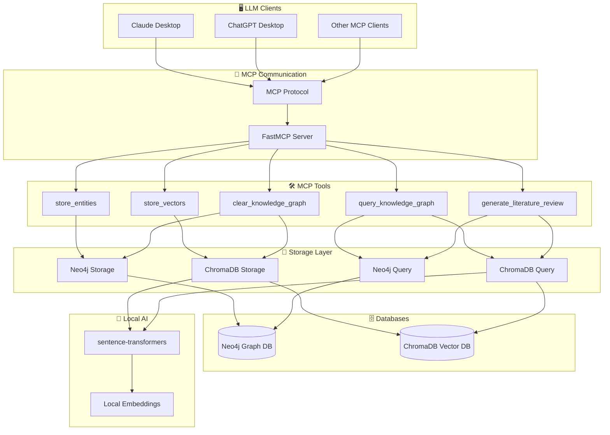
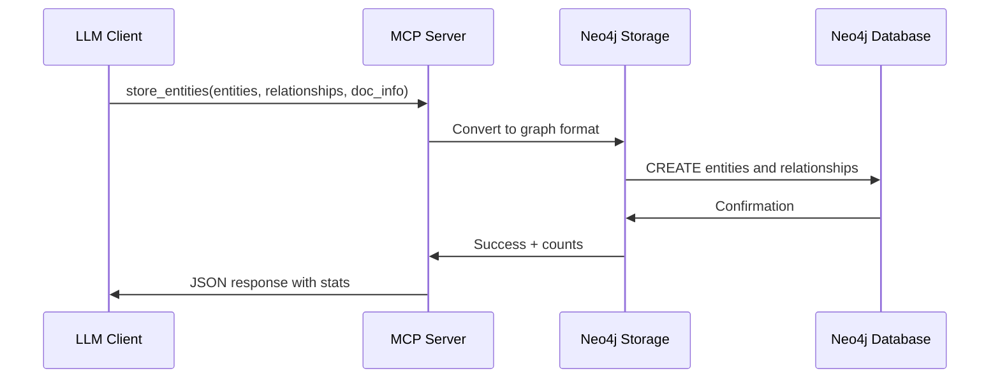
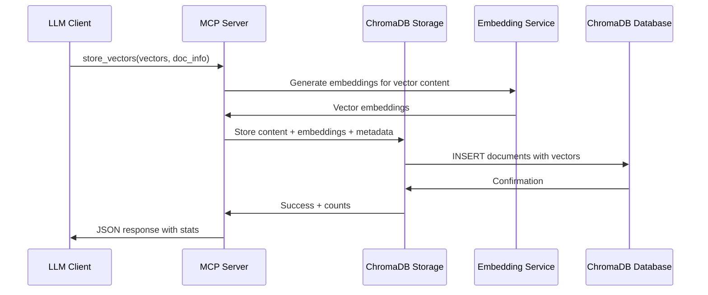
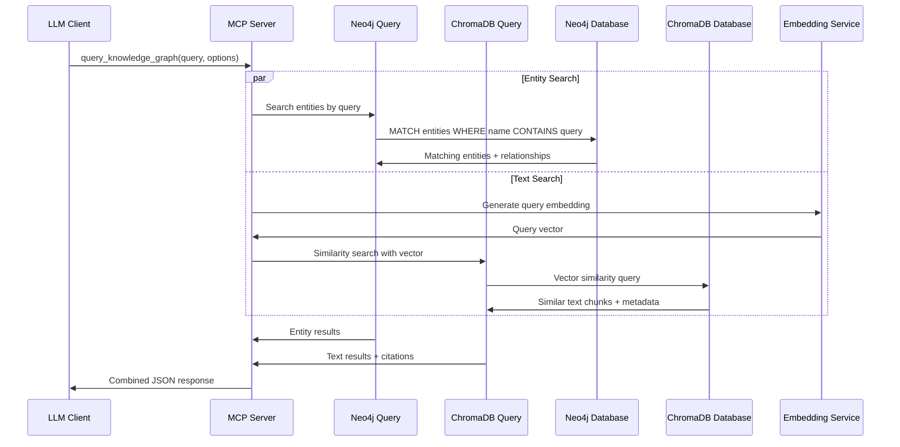

# MCP Server Architecture Flow

```mermaid
flowchart TD
    subgraph clients["🖥️ LLM Clients"]
        A[Claude Desktop]
        B[ChatGPT Desktop]
        C[Other MCP Clients]
    end
    
    subgraph comm["📡 MCP Communication"]
        D[MCP Protocol]
        E[FastMCP Server]
    end
    
    subgraph tools["🛠️ MCP Tools"]
        F[store_entities]
        G[store_vectors]
        H[query_knowledge_graph]
        I[generate_literature_review]
        J[clear_knowledge_graph]
    end
    
    subgraph storage["💾 Storage Layer"]
        K[Neo4j Storage]
        L[ChromaDB Storage]
        M[Neo4j Query]
        N[ChromaDB Query]
    end
    
    subgraph databases["🗄️ Databases"]
        O@{shape: database, label: "Neo4j Graph DB"}
        P@{shape: database, label: "ChromaDB Vector DB"}
    end
    
    subgraph embedding["🧠 Local AI"]
        Q[sentence-transformers]
        R[Local Embeddings]
    end
    
    A --> D
    B --> D
    C --> D
    
    D --> E
    
    E --> F
    E --> G
    E --> H
    E --> I
    E --> J
    
    F --> K
    G --> L
    H --> M
    H --> N
    I --> M
    I --> N
    J --> K
    J --> L
    
    K --> O
    L --> P
    M --> O
    N --> P
    
    L --> Q
    N --> Q
    Q --> R
```

## Data Flow Examples

### 1. Entity Storage Flow

```mermaid
sequenceDiagram
    participant LLM as LLM Client
    participant MCP as MCP Server
    participant Neo4j as Neo4j Storage
    participant DB as Neo4j Database
    
    LLM->>MCP: store_entities(entities, relationships, doc_info)
    MCP->>Neo4j: Convert to graph format
    Neo4j->>DB: CREATE entities and relationships
    DB->>Neo4j: Confirmation
    Neo4j->>MCP: Success + counts
    MCP->>LLM: JSON response with stats
```

### 2. Vector Storage Flow

```mermaid
sequenceDiagram
    participant LLM as LLM Client
    participant MCP as MCP Server
    participant Chroma as ChromaDB Storage
    participant Embed as Embedding Service
    participant DB as ChromaDB Database
    
    LLM->>MCP: store_vectors(vectors, doc_info)
    MCP->>Embed: Generate embeddings for vector content
    Embed->>MCP: Vector embeddings
    MCP->>Chroma: Store content + embeddings + metadata
    Chroma->>DB: INSERT documents with vectors
    DB->>Chroma: Confirmation
    Chroma->>MCP: Success + counts
    MCP->>LLM: JSON response with stats
```

### 3. Knowledge Query Flow

```mermaid
sequenceDiagram
    participant LLM as LLM Client
    participant MCP as MCP Server
    participant Neo4jQ as Neo4j Query
    participant ChromaQ as ChromaDB Query
    participant Neo4jDB as Neo4j Database
    participant ChromaDB as ChromaDB Database
    participant Embed as Embedding Service
    
    LLM->>MCP: query_knowledge_graph(query, options)
    
    par Entity Search
        MCP->>Neo4jQ: Search entities by query
        Neo4jQ->>Neo4jDB: MATCH entities WHERE name CONTAINS query
        Neo4jDB->>Neo4jQ: Matching entities + relationships
    and Text Search
        MCP->>Embed: Generate query embedding
        Embed->>MCP: Query vector
        MCP->>ChromaQ: Similarity search with vector
        ChromaQ->>ChromaDB: Vector similarity query
        ChromaDB->>ChromaQ: Similar text chunks + metadata
    end
    
    Neo4jQ->>MCP: Entity results
    ChromaQ->>MCP: Text results + citations
    MCP->>LLM: Combined JSON response
```