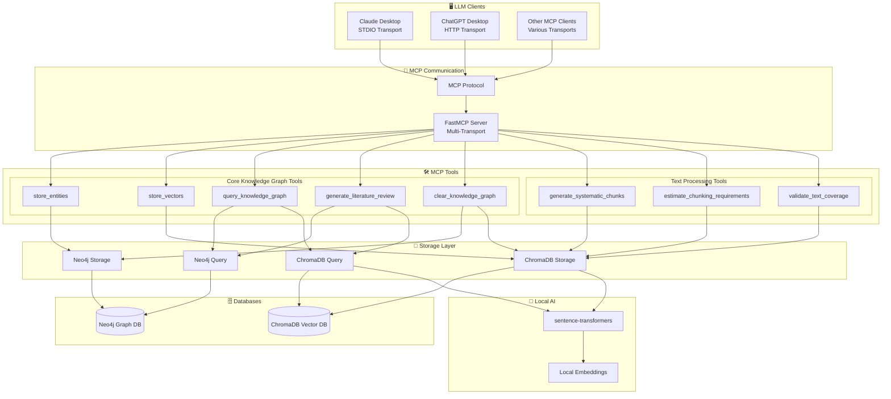
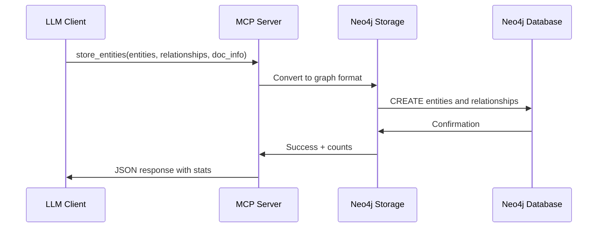
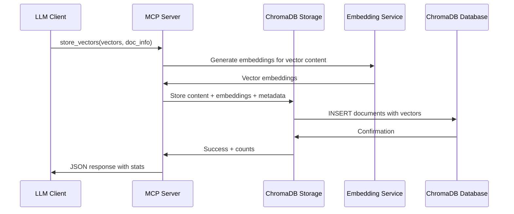
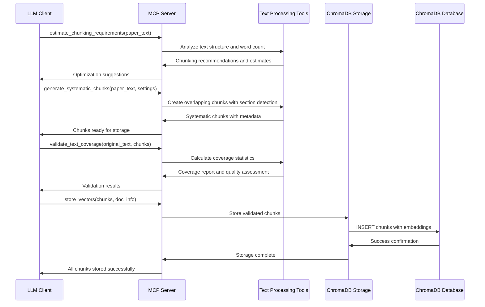
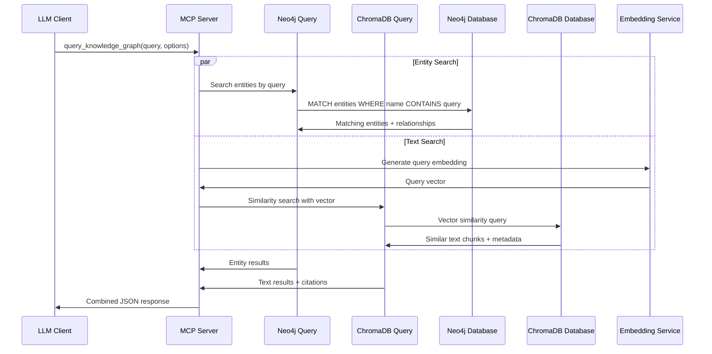

# MCP Server Architecture Flow

## Data Flow Examples

### 1. Entity Storage Flow

### 2. Vector Storage Flow

### 3. Text Processing Flow

### 4. Knowledge Query Flow

## Connection Methods

### Claude Desktop (STDIO Transport)
- **Configuration**: `claude_desktop_config.json` file
- **Transport**: STDIO (Standard Input/Output)
- **Setup**: No manual server startup required
- **How it works**: Claude Desktop launches the server automatically

### Other MCP Clients (HTTP Transport)
- **Configuration**: Manual HTTP server startup
- **Transport**: HTTP on localhost:3001
- **Setup**: Run `./scripts/start_http_server.sh`
- **How it works**: Client connects to running HTTP server

### Why Different Transports?
- **STDIO**: More secure, no network exposure, automatically managed
- **HTTP**: More flexible, easier for development, works across networks

Both methods use the same MCP protocol and provide identical functionality.